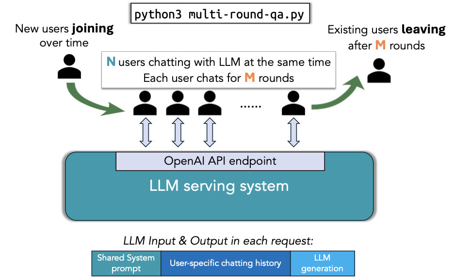

# Benchmarking vLLM Production Stack Performance with multi-round QA

## Overview

This repository contains benchmarking tools for evaluating vLLM Production Stack's performance (e.g., latency, throughput). The initial focus of this benchmark is on the multi-round QA (Question Answering) use case. The script `multi-round-qa.py` simulates multiple users interacting with a language model concurrently for multiple rounds, allowing you to analyze the serving engine's throughput and latency.

The overall workflow of this script is shown below 

## Setup

Installing the required packages needed to run the benchmark by:

```bash
pip install -r requirements.txt
```

## Running benchmarks

To run the multi-round QA benchmark, use the following example command:

```python
python3 multi-round-qa.py \
    --num-users 10 \
    --num-rounds 5 \
    --qps 0.5 \
    --shared-system-prompt 1000 \
    --user-history-prompt 2000 \
    --answer-len 100 \
    --model meta-llama/Llama-3.1-8B-Instruct \
    --base-url http://localhost:30080/v1
```

Use ctrl-C to terminate the benchmark at any time, and the the script will write each request's detailed stats to `summary.csv`.

Note: the above command requires there is a serving engine with the `meta-llama/Llama-3.1-8B-Instruct` model served locally at ``http://localhost:30080/v1``. Here's an example command to launch the serving engine with vLLM Production Stack:

```bash
helm repo add vllm https://vllm-project.github.io/production-stack
helm install vllm vllm/vllm-stack -f model.yaml
```

And then do port-forwarding with the following command:

```bash
sudo kubectl port-forward svc/vllm-router-service 30080:80
```

### Explanation of the arguments

#### Configuring the workload

- `--num-users <int>`: The maximum number of concurrent users in the system (N in the above figure).
- `--num-rounds <int>`: The number of rounds per user (M in the above figure).
- `--qps <float>`: The overall queries per second (QPS) rate for the system.
- `--shared-system-prompt <int>`: Length of the system prompt shared across all users (in tokens).
- `--user-history-prompt <int>`: Length of the user-specific context (simulating existing chat history) (in tokens).
- `--answer-len <int>`: Length of the answer expected (in tokens).
- `--init-user-id <int>`: The initial user ID to start the benchmark (default = 0). This is useful when you want to resume the benchmark from a specific user ID or avoid serving engine caching the request from previous runs
- `--request-with-user-id`: If this option is present, the script will include the user ID in the request header.
- `--sharegpt`: If this option is present, the script will use ShareGPT workload instead of dummy context.

_Note:_ If you use ShareGPT dataset, the length of the answer expected (in tokens) will be determined by the min value of the dataset response and `--answer-len`. You also need to follow the instructions in **ShareGPT Datasets** first.

#### Configuring the serving engine connection

- `--model <str>`: The model name (e.g., `mistralai/Mistral-7B-Instruct-v0.2`).
- `--base-url <str>`: The URL endpoint for the language model server.

#### Configuring the experiment (Optional)

- `--output <str>`: The csv file to dump the detailed stats for each query (default = summary.csv)
- `--log-interval <float>`: Time between each performance summary log in seconds (default = 30)
- `--time <float>`: Total time to run the experiment (default = forever)

#### Processing previous outputs only (Optional)

- `--process-summary <filename>`: if this option is present, the script will only process the existing output csv and print out the summary without running any experiment.

## Benchmark Metrics

- **Queries Per Second (QPS)**: The average number of queries processed by the model per second.
- **Average Prompt Throughput**: Tokens generated in the prompt per second.
- **Average Generation Throughput**: Tokens generated as part of the response per second.
- **Average TTFT (Time to First Token)**: Average time taken for the model to generate the first token of a response.

## ShareGPT Datasets

1. Download and prepare the ShareGPT dataset
   You can specify the proportion of data to process by providing a number between 0 and 1 as an argument to the script.

   ```bash
   bash prepare_sharegpt_data.sh 1
   ```

   In this example, 1 indicates processing 100% of the dataset. You can adjust this value as needed.

2. Run the benchmark
   Example:

   ```bash
   python3 multi-round-qa.py \
       --num-users 10 \
       --num-rounds 5 \
       --qps 0.3 \
       --shared-system-prompt 1000 \
       --user-history-prompt 2000 \
       --answer-len 100 \
       --model mistralai/Mistral-7B-Instruct-v0.2 \
       --base-url http://localhost:8000/v1 \
       --sharegpt
   ```
