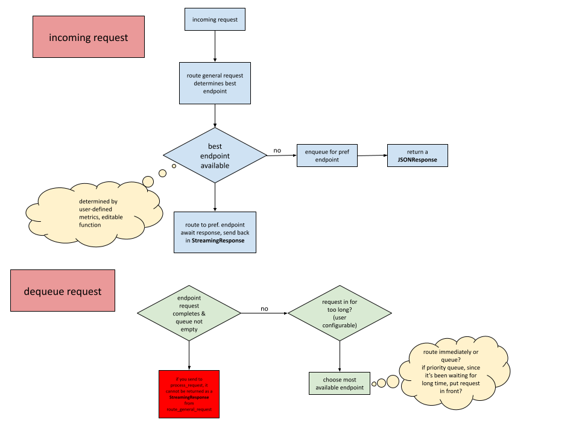

# Queue Manager for LLM Endpoint Routing

This module implements an asynchronous queue manager for dispatching of LLM inference requests to backend endpoints. It directly dispatches or queues requests based on endpoint load and endpoint metrics, improving overall Quality of Experience (QoE).

---

## Features

- Per-endpoint asynchronous request queues
- Condition-based dispatching using `asyncio.Condition`
- Request rerouting if an endpoint remains overloaded too long
- Session affinity preservation (stubbed for future KV cache usage)
- Graceful shutdown of all schedulers

---

## Flow Chart



---


## File: `services/queue_manager.py`

### Class: `EndpointQueueManager`

This class manages:

- `endpoint_queues`: A `PriorityQueue` per endpoint holding pending requests.
- `conditions`: An `asyncio.Condition` per endpoint used to notify the scheduler loop.
- `endpoint_tasks`: Background async tasks for each endpoint’s queue loop.
- `EngineStatsScraper`: Periodically scrapes GPU & model stats per endpoint.

---

## Request Lifecycle

### 1. Check Endpoint Availability

```python
if not queue_manager._endpoint_is_free(server_url):
```

- If the endpoint is overloaded (e.g. high GPU usage or too many active requests), the request is queued.
- If it's free, the request is dispatched immediately.

---

### 2. Enqueue Logic

```python
queue_manager.register_endpoint(server_url)

await queue_manager.enqueue(
    server_url,
    {
        "request": request,
        "request_id": request_id,
        "body": request_body,
        "endpoint": endpoint,
        "background_tasks": background_tasks
    },
    priority=queue_manager.calculate_request_priority(request)
)
```

- Registers the endpoint queue and scheduler if not already present.
- Adds the request to a `PriorityQueue`.
- Notifies the condition variable to wake the scheduler.

If queued, returns a `202 Accepted`:

```json
{
  "status": "queued",
  "endpoint": "http://..."
}
```

---

### 3. Scheduler Loop

```python
async def _scheduler_loop(self, endpoint_url: str):
```

Runs a background task for each endpoint:

- Waits for new requests in the queue.
- If a request has waited longer than max_queue_wait_time, the scheduler calls `_reroute_or_dispatch_stale_request` to determine next actions.
- If the endpoint is free, dispatches the request.


---

### 4. Dispatch Logic

```python
async def _dispatch_and_signal(...)
```

- Sends the request to the backend via `process_request(...)`.
- Returns a streaming response with appropriate headers.

---

### 5. Rerouting Stale Requests

If a request exceeds the `max_queue_wait_time` threshold:

```python
await self._reroute_or_dispatch_stale_request(request, original_endpoint)
```

- Attempts to reroute the request to a different free endpoint.
- If session affinity (based on session ID) applies, keeps it on the original endpoint.
- If the new endpoint is also busy, queues the request there.

---

## Configuration

```python
queue_manager = EndpointQueueManager(max_queue_wait_time=10)
```

- `max_queue_wait_time`: Max seconds a request can wait in queue before being rerouted or retried.

---


## Dependencies

- `asyncio`
- `EngineStatsScraper` from `vllm_router.stats.engine_stats`
- `process_request()` from `vllm_router.services.request_service.request`

---

## TODOs

- [ ] Implement KV cache-aware session affinity logic
- [ ] Improve request priority classification
- [ ] Make queue limits and load thresholds configurable
- [ ] Retry policies and smarter rerouting heuristics

---
