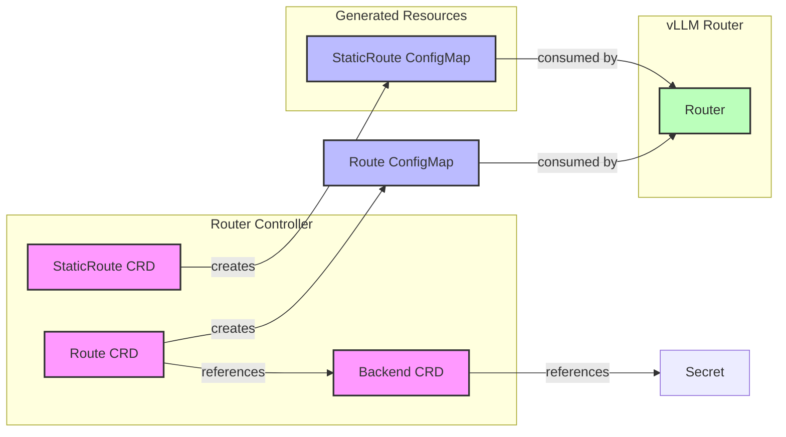
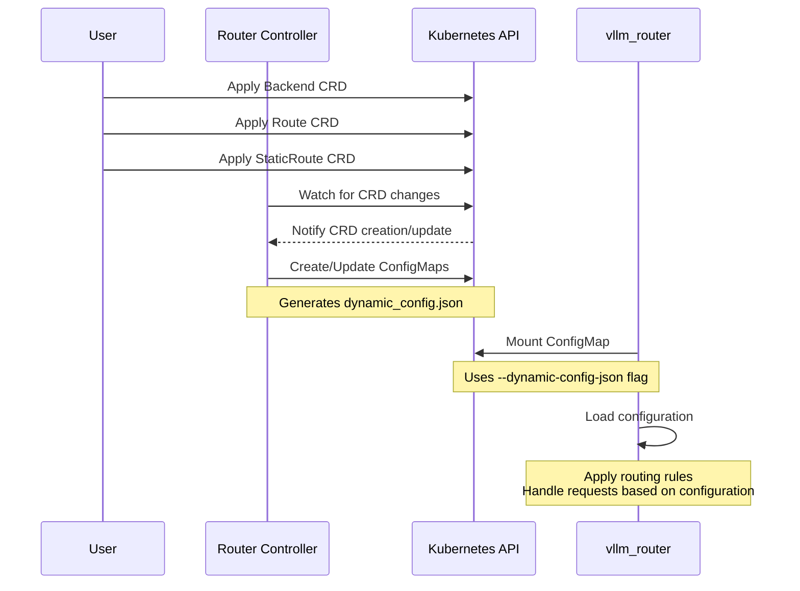

# Router Controller

This is the controller for the Router CRDs. It is responsible for creating and updating the ConfigMap for the vllm_router.

## Description

The Router Controller is a Kubernetes controller that manages the Router custom resource. It watches for Router resources and creates a ConfigMap for the vllm_router.

## Getting Started

### Prerequisites

- go version v1.22.0+
- docker version 17.03+.
- kubectl version v1.11.3+.
- Access to a Kubernetes v1.11.3+ cluster.

### To Deploy on the cluster

**Build and push your image to the location specified by `IMG`:**

```sh
make docker-build docker-push IMG=<some-registry>/router-controller:tag
```

**NOTE:** This image ought to be published in the personal registry you specified.
And it is required to have access to pull the image from the working environment.
Make sure you have the proper permission to the registry if the above commands don't work.

**Install the CRDs into the cluster:**

```sh
make install
```

**Deploy the Manager to the cluster with the image specified by `IMG`:**

```sh
make deploy IMG=<some-registry>/router-controller:tag
```

> **NOTE**: If you encounter RBAC errors, you may need to grant yourself cluster-admin
privileges or be logged in as admin.

**Create instances of your solution**
You can apply the samples (examples) from the config/sample:

```sh
kubectl apply -k config/samples/
```

>**NOTE**: Ensure that the samples has default values to test it out.

### To Uninstall

**Delete the instances (CRs) from the cluster:**

```sh
kubectl delete -k config/samples/
```

**Delete the APIs(CRDs) from the cluster:**

```sh
make uninstall
```

**UnDeploy the controller from the cluster:**

```sh
make undeploy
```

## Project Distribution

Following are the steps to build the installer and distribute this project to users.

### Build the installer

Build the installer for the image built and published in the registry:

```sh
make build-installer IMG=<some-registry>/router-controller:tag
```

NOTE: The makefile target mentioned above generates an 'install.yaml'
file in the dist directory. This file contains all the resources built
with Kustomize, which are necessary to install this project without
its dependencies.

### Using the installer

Users can just run kubectl apply -f <URL for YAML BUNDLE> to install the project, i.e.:

```sh
kubectl apply -f https://raw.githubusercontent.com/<org>/router-controller/<tag or branch>/dist/install.yaml
```

## Architecture and Component Relationships

### CRD Relationships


### Configuration Flow


## StaticRoute CRD

The StaticRoute CRD allows you to configure the vllm_router with static backends and models. The controller reads the CRD and creates a ConfigMap that can be used by the vllm_router with the `--dynamic-config-json` option.

### Example

```yaml
apiVersion: production-stack.vllm.ai/v1alpha1
kind: StaticRoute
metadata:
  name: staticroute-sample
spec:
  # Service discovery method
  serviceDiscovery: static

  # Routing logic
  routingLogic: roundrobin

  # Comma-separated list of backend URLs
  staticBackends: "http://localhost:9001,http://localhost:9002,http://localhost:9003"

  # Comma-separated list of model names
  staticModels: "facebook/opt-125m,meta-llama/Llama-3.1-8B-Instruct,facebook/opt-125m"

  # Name of the vllm_router to configure
  routerRef:
    kind: Service
    apiVersion: v1
    name: vllm-router
    namespace: default

  # Optional: Name of the ConfigMap to create
  configMapName: vllm-router-config
```

## Backend CRD

The Backend CRD allows you to configure the vllm_router with a backend. The controller reads the CRD and creates a ConfigMap that can be used by the vllm_router with the `--dynamic-config-json` option.

### Example

```yaml
apiVersion: production-stack.vllm.ai/v1alpha1
kind: Backend
metadata:
  name: backend-sample
spec:
  # Type of backend
  type: vllm

  # Endpoint URL
  endpoint:
    url: "http://10.100.245.131:8000"

  # Comma-separated list of model names
  models: "facebook/opt-6.7b"

  # Secret reference for API key
  secretRef:
    name: openai-api-key
    key: api-key
    # namespace: default  # Optional, defaults to the same namespace as the Backend

  # Health check configuration
  healthCheck:
    # Number of seconds after which the probe times out
    timeoutSeconds: 30

    # Number of seconds between probe attempts
    periodSeconds: 10

    # Minimum consecutive successes for the probe to be considered successful
    successThreshold: 1

    # Minimum consecutive failures for the probe to be considered failed
    failureThreshold: 3

  # Maximum number of concurrent requests
  maxConcurrentRequests: 100

  # Request timeout in seconds
  timeout: 300 
```

### Secret Reference for API Keys

When using the OpenAI API schema, a secret reference is required to provide the API key. The secret reference consists of:

- `name`: The name of the Kubernetes Secret resource
- `key`: The key within the Secret that contains the API key
- `namespace`: (Optional) The namespace of the Secret. If not specified, it defaults to the same namespace as the Route.

Example Secret resource:

```yaml
apiVersion: v1
kind: Secret
metadata:
  name: openai-api-key
  namespace: default
type: Opaque
data:
  # Base64 encoded API key
  api-key: c2stZXhhbXBsZS1vcGVuYWktYXBpLWtleQ==
```

The controller will read the API key from the Secret and include it in the dynamic configuration for the vllm_router.

## Route CRD

The Route CRD allows you to configure dynamic routing based on URL paths and API schemas. It references a Backend resource and creates a ConfigMap with the routing configuration.

### Example

```yaml
apiVersion: production-stack.vllm.ai/v1alpha1
kind: Route
metadata:
  name: route-sample
spec:
  # Reference to the Backend resource
  backendRef:
    kind: Backend
    apiVersion: production-stack.vllm.ai/v1alpha1
    name: backend-sample
    namespace: default

  # URL path to match for this route
  path: "/v1/completions"

  # API schema supported by this route
  apiSchema: "openai"

  # Routing weight for this route (0-100)
  weight: 100

  # Semantic caching configuration (optional)
  semanticCachingEnabled: false

  # Reference to the ConfigMap to create
  configMapRef:
    kind: ConfigMap
    apiVersion: v1
    name: route-sample-config
    namespace: default

  # Request timeout in seconds
  timeout: 300

  # Rate limit per minute (0 means no limit)
  rateLimitPerMinute: 0

  # Additional headers can be configured (optional)
  #headers:
  #  X-API-Key: "${API_KEY}"
```

### How it works

- The controller watches for StaticRoute resources.
- When a StaticRoute is created or updated, the controller creates or updates a ConfigMap with the dynamic configuration.
- The ConfigMap contains a `dynamic_config.json` file with the following structure:

```json
{
  "service_discovery": "static",
  "routing_logic": "roundrobin",
  "static_backends": "http://localhost:9001,http://localhost:9002,http://localhost:9003",
  "static_models": "facebook/opt-125m,meta-llama/Llama-3.1-8B-Instruct,facebook/opt-125m"
}
```

- The controller checks the health endpoint of the vllm_router services that match the `routerSelector` to verify that the configuration is valid.
- The vllm_router should be configured to use the ConfigMap with the `--dynamic-config-json` option:

```yaml
containers:
- name: vllm-router
  image: vllm-router:latest
  args:
  - "--dynamic-config-json /etc/vllm-router/dynamic_config.json"
  volumeMounts:
  - name: config-volume
    mountPath: /etc/vllm-router
volumes:
- name: config-volume
  configMap:
    name: vllm-router-config
```

### Status

The StaticRoute resource has the following status fields:

- `configMapRef`: The name of the ConfigMap that was created.
- `lastAppliedTime`: The time when the configuration was last applied.
- `conditions`: A list of conditions that represent the latest available observations of the StaticRoute's state.
