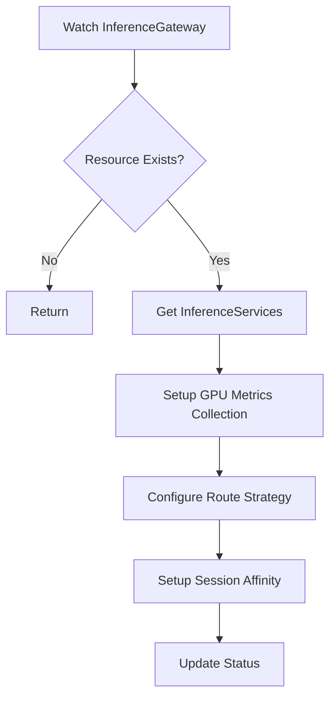
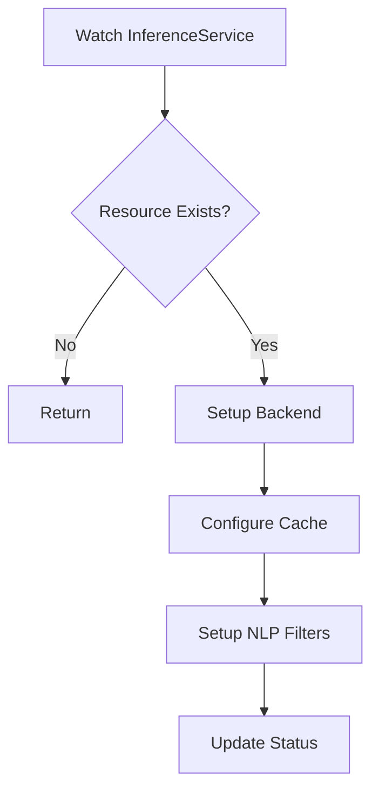
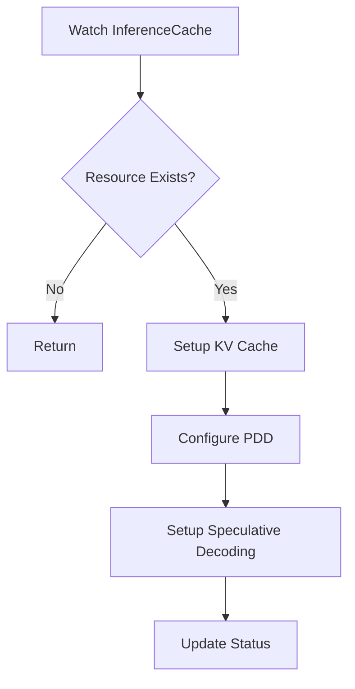
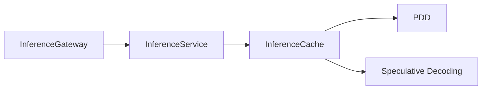
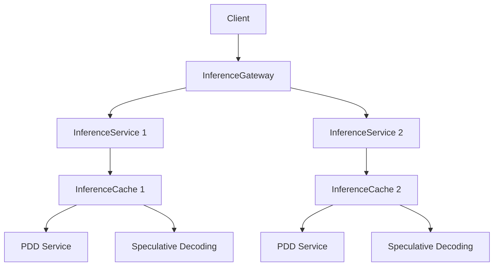

# GPU and Cache Aware Inference Controller Design

## Overview

The Inference Controller is a Kubernetes operator that manages the routing and orchestration of vLLM inference services. It provides a declarative way to manage model serving, caching, and routing in a Kubernetes environment.

## Use Cases

1. **Model Serving Orchestration**
   - Deploy and manage vLLM inference services
   - Configure tensor parallelism for distributed model serving

2. **Caching Layer Management**
   - Deploy and manage KV cache, attention cache, and hybrid cache services
   - Configure cache size, TTL, and transfer policies
   - Monitor cache performance and statistics

3. **Intelligent Request Routing**
   - Route requests to appropriate model instances using routing rules
   - Implement session affinity for consistent model access

4. **Performance Optimization**
   - Enable speculative decoding for faster inference
   - Support prefill-decoding disaggregation
   - Implement efficient cache transfer policies

## Custom Resource Definitions (CRDs)

### InferenceGateway

The `InferenceGateway` CRD manages the routing layer for model inference requests with GPU-aware and cache-efficient routing.

```yaml
apiVersion: production-stack.vllm.ai/v1alpha1
kind: InferenceGateway
metadata:
  name: llm-gateway
spec:
  schedulingPolicy: "gpu-load-aware"       # Use GPU metrics for routing
  routeStrategy: "PrefixHash"              # Enable prefix-based routing for cache affinity
  sessionAffinity: true                    # Ensure multi-turn sessions are pinned
  routes:
    - model: "llama3-70b"
      inferenceServiceRef: "llama3-chatbot-service"
    - model: "mistral3"
      inferenceServiceRef: "mistral-agent-service"
```

### InferenceService

The `InferenceService` CRD manages individual model serving instances with integrated caching and NLP filtering.

```yaml
apiVersion: production-stack.vllm.ai/v1alpha1
kind: InferenceService
metadata:
  name: llama3-chatbot-service
spec:
  modelName: "llama3-70b"
  backendRef: "chatbot-service-backend"
  inferenceCacheRef: "llama3-chatbot-cache"
  nlpFilters:
    semanticCache:
      storeRef: "redis-nlp-cache"
      threshold: 0.85
      ttlSeconds: 3600
    promptGuard:
      blockedPatterns:
        - "Name"
        - "SSN"
```

### InferenceCache

The `InferenceCache` CRD manages GPU KV caching with support for PDD and speculative decoding.

```yaml
apiVersion: production-stack.vllm.ai/v1alpha1
kind: InferenceCache
metadata:
  name: llama3-chatbot-cache
spec:
  modelName: "llama3-70b"
  kvCacheTransferPolicy:
    thresholdHitRate: 0.8
    evictionThreshold: 0.9
  pddRef: "pdd-llama3-chatbot"
  sdRef: "sd-llama3-chatbot"
```

### SpeculativeDecoding

The `SpeculativeDecoding` CRD manages speculative decoding configuration.

```yaml
apiVersion: production-stack.vllm.ai/v1alpha1
kind: SpeculativeDecoding
metadata:
  name: sd-llama3-chatbot
spec:
  draftModel: "llama3-1b"
  targetModel: "llama3-70b"
```

### PrefillDecodingDisaggregation

The `PrefillDecodingDisaggregation` CRD manages PDD configuration and topology.

```yaml
apiVersion: production-stack.vllm.ai/v1alpha1
kind: PrefillDecodingDisaggregation
metadata:
  name: pdd-llama3-chatbot
spec:
  modelName: "llama3-70b"
  topologyHint:
    nodeSelector:
      gpuType: "NVIDIA-A100"
      zone: "rack1"
status:
  prefillPod: "llama3-chatbot-prefill-0"
  decodeTargetPod: "llama3-chatbot-decode-1"
```

## Controller Flow

### InferenceGateway Controller



### InferenceService Controller



### InferenceCache Controller



## Resource Relationships



## Deployment Architecture


