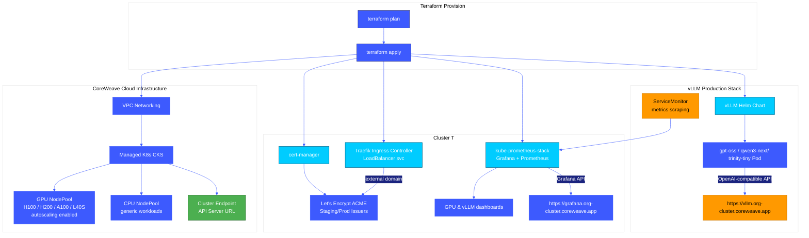

# 🧑🏼‍🚀 vLLM Production Stack on CoreWeave CKS with Terraform



✍🏼 This guide demonstrates how to deploy a high-performance **vLLM Production Stack** on **CoreWeave Kubernetes Service (CKS)**.

| Project Item | Description |
| --- | --- |
| **Author** | [@cloudthrill](https://cloudthrill.ca) |
| **Stack** | Terraform ◦ Helm ◦ CoreWeave Cloud ◦ CKS (K8s) ◦ vLLM Inference ◦ Observability ◦ LetsEncrypt |
| **Module** | Opinionated **GPU-first** blueprint for vLLM production stack inference on CoreWeave |
| **Networking** | **Cilium CNI** + Traefik with custom CIDR pools for Pods, Services, and LoadBalancers |
| **Inference hardware** | **NVIDIA H100, H200, GB200, A100, or L40S** NodePools with native CKS autoscaling |
| **Included LLM catalog** | Gpt-oss(20b/120b), Qwen3-next 80B, Gemma-3-27b-vision, GLM 4.7 flash, Trinity-Mini (3 charts)|

---
<!-- markdownlint-disable MD004 MD010 MD012 MD022 MD029 MD031 MD032 MD034 MD038 MD040 MD058 MD036-->
## 📋 Table of Contents

1. [Project Structure](#-project-structure)
2. [Prerequisites](#-prerequisites)
3. [What Terraform Deploys](#%EF%B8%8F-what-terraform-deploys)
4. [Hardware Options](#%EF%B8%8Fcoreweave-gpu-instance-types-available)
5. [Configuration Knobs](#%EF%B8%8F-configuration-knobs)
6. [Quick Start](#-quick-start)
7. [Quick Test](#-quick-test)
8. [Observability](#-observability)
9. [Troubleshooting](#-troubleshooting)
10. [Additional Resources](#-additional-resources)

---

## 📂 Project Structure

```bash
./
├── cluster-tools.tf          # Cert-manager, Traefik, Monitoring, Metrics-server
├── main.tf                   # CKS Cluster & NodePool logic
├── network.tf                # CoreWeave VPC & IP Prefixes (Pod/Svc/LB CIDRs)
├── output.tf                 # Unified Stack Dashboard output
├── provider.tf               # CoreWeave, Helm, & Kubectl provider config
├── variables.tf              # Configurable knobs & defaults
├── vllm-production-stack.tf  # vLLM Helm release & logic
├── env-vars.template         # Environment variable boilerplate
├── terrafom.tfvars.template  # Terraform variable boilerplate
├── config/
│   ├── helm/
│   │   └── kube-prome-stack.yaml
│   ├── llm-stack/
│   │   └── helm/
│   │       └── gpu/
│   │           ├── gpu-gpt-oss-20-cw.tpl        # Open Source models config
│   │           ├── gpu-gpt-qwn-gem-glm-cw.tpl   # Qwen/Gemma/GLM variants
│   │           └── gpu-llama-light-ingress-cw.tpl
│   ├── manifests/
│   │   ├── audit-policy.yaml
│   │   ├── letsencrypt-issuer-prod.yaml        # Let's Encrypt config
│   │   ├── letsencrypt-issuer-stage.yaml       # Staging Let's Encrypt config
│   │   ├── nodepool-cpu.yaml                   # CPU NodePool CRD manifest
│   │   └── nodepool-gpu.yaml                   # GPU NodePool CRD manifest
│   ├── vllm-dashboard-oci.json                 # vLLM per model Inference Observability
│   └── vllm-dashboard.json                     # vllm and Kvcache observability
└── README.md                                # ← You are here

```

---

## ✅ Prerequisites

| Tool | Version tested | Notes |
| --- | --- | --- |
| **Terraform** | ≥ 1.5.8 | Tested on  1.9.8  |
| **CoreWeave CLI (cwic)** | Latest | Primary CLI for CKS interaction and Kubeconfig generation |
| **CoreWeave provider** | 0.10.1 | Native provider for CKS clusters and NodePool orchestration. |
| **kubectl** | ≥ 1.31 | ±1 of control-plane |
| **helm** | ≥ 3.14 | Used by `helm_release` |
| **gavinbunney/kubectl** | 1.19.0 | The Manifest Engine. Best-in-class for raw YAML and NodePool CRDs. |


<details>
<summary><b>👇🏼☁️Install CoreWeave Cloud CLI (cwic) below👇🏼</b></summary>


```bash
# Download and extract the binary
# 1. Download and extract the binary
curl -fsSL https://github.com/coreweave/cwic/releases/latest/download/cwic_$(uname)_$(uname -m).tar.gz | tar zxf - cwic && mv cwic $HOME/.local/bin/

```
</details>

**Configure Coreweave CLI**

```bash
# 2. Authenticate (Interactive)
cwic auth login

# OR Authenticate using a Token
cwic auth login <YOUR_TOKEN> --name "Production"

# 3. Verify Identity
cwic auth whoami

```
Learn more about cwic commands on my [coreweave-blog-post](https://cloudthrill.ca/explore-coreweave-ai-cloud)

---

## 🏗️ What Terraform Deploys
(example: gpt-oss-20b): Total end-to-end deployment for a production Reasoning API (GPT-OSS-20B) is approximately **40 minutes**.
| Phase | Component | Duration | Observation |
| :--- | :--- | :--- | :--- |
| **Phase 1** | **VPC & CKS API** | ~4 min | Control plane initialization. |
| **Phase 2** | **CPU NodePool** | ~19 min | 1-Interl/AMD-Bare-metal Node   |
| **Phase 3** | **GPU NodePool** | ~15 min | 1-H100 Bare-metal Node once the CPU-nodepool is stable. |
| **Phase 4** | **vLLM Engine** | ~12 min | Model pull + GPU KV Cache & CUDA Graph warmup. |
| **Total** | **Full Stack** | **~40-44 min** | **From zero to H100-backed Inference.** |

**Model Options:**
There are 3 different vllm deployment charts:
- [gpu-gpt-oss-20b](./config/gpu-gpt-oss-20-cw.tpl) | [oss flagship LLM collection](./config/gpu-gpt-qwn-gem-glm-cw.tpl) | [tiny-llama](./config/gpu-llama-light-ingress-cw.tpl) . (for DeepseekV3 read 🐳here)

---

## ⚙️ Provisioning Highlights

* ✅ **One-Click Deployment**: 100% automated vLLM stack with zero manual intervention

* ✅ **Zero Dependencies**: No pre-existing cluster/kubeconfig required - built from scratch with just a user token

* ✅ **Full Add-on Suite**: Traefik, cert-manager, metrics-server, Let's Encrypt Issuers, Prometheus, and Grafana included

* ✅ **Smart GPU Mapping**: Friendly names (H100, B200) → actual CoreWeave instance IDs with AZ validation (fails fast if unsupported)

* ✅ **Production SSL**: Auto-provisioned HTTPS for vLLM & Grafana via
  ```
  https://<vllm_prefix>.<org_id>-<cluster_name>.coreweave.app
  ```

* 🏁🛑 **Race Condition Guards**:

| Guard Type | Purpose | Behavior |
|------------|---------|----------|
| **NodePool State Polling** | Ensures nodes are Ready | Waits for node Ready status before deploying workloads |
| **DNS Readiness Guard** | Verifies API server DNS propagation | Polls Cloudflare DNS for K8s API server resolution before proceeding |

---


### 1. 📶 Networking (template)
| Feature | Configuration |
| :--- | :--- |
| **Load Balancer CIDR** | `10.20.0.0/22` dedicated prefix for ingress endpoints. |
| **Pod CIDR** | `10.244.0.0/16` providing a massive IP space for high-density GPU scaling. |
| **Service CIDR** | `10.96.0.0/16` for internal cluster-IP orchestration. |
| **CNI** | Native Cilium CNI for eBPF-powered policy enforcement, Overlay (VXLAN), and Hubble flow observability. |
| **Ingress** | Traefik Ingress Controller exposed via **CoreWeave Load Balancer**. |
| **SSL Certification** |  Letsencrypt ClusterIssuer encrypts and certifies (VLLM and grafana) Ingress endpoints. |

### 2. ☸️ CKS Cluster

- Control plane v1.35 with two managed node-group types (CPU and GPU)
- Storage:	VAST Data Storage is a High-throughput storage for massive model weights (shared-vast)

### 3. 📦 Add-ons

Core CKS add-ons are pre-optimized for AI workloads. We added below K8s addons to enable this build
| Category | Add-on | Notes |
| :--- | :--- | :--- |
| **Ingress/LB** | **Traefik Ingress** | Integrated with CoreWeave LB |
| **Observability** | **kube-prometheus-stack/metrics-server** | Includes GPU-specific DCGM metrics |
| **Security** | **cert-manager** | Let's Encrypt HTTP-01 automation |
| **GPU** | **Pre-baked NVIDIA drivers** | No separate GPU operator required |

### 4. 🧠 vLLM Production Stack (CPU/GPU)
| Feature | Implementation |
| :--- | :--- |
| **Model Serving** | (Default) Single GPT-OSS-20B model replica. |
| **Load Balancing** | Round-robin request router service. |
| **Hugging Face Token** | Securely stored as a Kubernetes Secret. |
| **LLM Storage** | Init container for persistent model caching under `/data/models/` using VAST Data. |
| **Default Helm Chart** | [`gpu-gpt-oss-20-cw.tpl`](./config/llm-stack/helm/gpu/gpu-gpt-oss-20-cw.tpl). |
| **Observability** | **2x vLLM Dashboards**: Pre-configured Grafana views for KV Cache and Inference Performance. |

---

## 🖥️Coreweave GPU Instance Types Available

From high-density Blackwell clusters to cost-optimized L40S inference nodes. View the full [CoreWeave GPU Catalog](https://www.coreweave.com/gpu-cloud-pricing).
<details><summary><b>Available CoreWeave GPU Instances</b></summary>
<br>

| GPU Instance Model | GPU Count | VRAM (GB) | vCPUs | RAM (GB) | Price/h |
| :--- | :--- | :--- | :--- | :--- | :--- |
| **NVIDIA GB300 NVL72** | 1 (Rack) | 20,736 | 2,592 | 18,432 | Contact Sales |
| **NVIDIA GB200 NVL72** | 1 (Rack) | 13,824 | 2,592 | 18,432 | $42.00* |
| **NVIDIA B200 SXM** | 8 | 1,536 | 128 | 2,048 | $68.80 |
| **RTX 6000 Blackwell** | 8 | 768 | 128 | 1,024 | $20.00 |
| **NVIDIA HGX H100** | 8 | 640 | 128 | 2,048 | $49.24 |
| **NVIDIA HGX H200** | 8 | 1,128 | 128 | 2,048 | $50.44 |
| **NVIDIA GH200** | 1 | 96 | 72 | 480 | $6.50 |
| **NVIDIA L40** | 8 | 384 | 128 | 1,024 | $10.00 |
| **NVIDIA L40S** | 8 | 384 | 128 | 1,024 | $18.00 |
| **NVIDIA A100 (80GB)** | 8 | 640 | 128 | 2,048 | $21.60 |

*\*Estimated entry price for reserved capacity.*
</details>

---

## 🛠️ Configuration Knobs

This stack provides extensive customization options to tailor your deployment:

| Variable | Default | Description |
| :--- | :--- | :--- |
| `cw_token` | — (required) | CoreWeave API Token |
| `org_id` | — (required) | CoreWeave Organization ID (`cwic auth whoami`) |
| `region` | `US-EAST-06` | Deployment region (e.g., US-EAST-06, ORD1) |
| `zone` | `US-EAST-06A` | Specific CoreWeave Availability Zone |
| `cluster_name` | `vllm-cw-prod` | Name of the CKS Managed Cluster |
| `k8s_version` | `1.34` | Kubernetes version (e.g., 1.34, 1.35) |
| `enable_nodepool_gpu`| `true` | Enable/Disable external GPU node |
| `public_endpoint` | `true` | Enable/Disable external API access |
| `cpu_instance_id` | `cd-gp-i64-erapids` | Bare-metal CPU type (e.g., Turin, Emerald Rapids) |
| `gpu_instance_type` | `H100` | Bare-metal GPU type (H100, A100, L40S, etc.) |
| `enable_vllm` | `true` | Deploy the vLLM engine and request router |
| `hf_token` | **«secret»** | Hugging Face token for model downloads |
| `grafana_admin_password` | `admin1234` | Admin password for monitoring dashboard |
| `letsencrypt_email` | — (required) | Email for SSL/TLS certificate registration |

### 📋 Complete Configuration Options

 The stack supports over 20+ configurable options around **Networking** | **Nodepools** | **Observability** | **vLLM Tuning**.

**📓 Configuration templates:**

- **Environment variables**: [`env-vars.template`](./env-vars.template)
- **Terraform variables**: [`terraform.tfvars.template`](./terraform.tfvars.template)


<details><summary><b> Full list of variables 👇🏼</b></summary>

## Requirements

| Name | Version |
|------|---------|
| <a name="requirement_coreweave"></a> [coreweave](#requirement\_coreweave) | 0.10.1 |
| <a name="requirement_helm"></a> [helm](#requirement\_helm) | >= 2.15 |
| <a name="requirement_kubectl"></a> [kubectl](#requirement\_kubectl) | >= 1.19.0 |
| <a name="requirement_kubernetes"></a> [kubernetes](#requirement\_kubernetes) | ~> 2.10 |
| <a name="requirement_local"></a> [local](#requirement\_local) | >= 2.5 |

## Providers

| Name | Version |
|------|---------|
| <a name="provider_coreweave"></a> [coreweave](#provider\_coreweave) | 0.10.1 |
| <a name="provider_helm"></a> [helm](#provider\_helm) | 3.1.1 |
| <a name="provider_kubectl"></a> [kubectl](#provider\_kubectl) | 1.19.0 |
| <a name="provider_null"></a> [null](#provider\_null) | 3.2.4 |
| <a name="provider_template"></a> [template](#provider\_template) | 2.2.0 |
| <a name="provider_terraform"></a> [terraform](#provider\_terraform) | n/a |

## Modules

No modules.

## Resources

| Name | Type |
|------|------|
| [coreweave_cks_cluster.k8s](https://registry.terraform.io/providers/coreweave/coreweave/0.10.1/docs/resources/cks_cluster) | resource |
| [coreweave_networking_vpc.k8s](https://registry.terraform.io/providers/coreweave/coreweave/0.10.1/docs/resources/networking_vpc) | resource |
| [helm_release.cert_manager](https://registry.terraform.io/providers/hashicorp/helm/latest/docs/resources/release) | resource |
| [helm_release.kube_prometheus_stack](https://registry.terraform.io/providers/hashicorp/helm/latest/docs/resources/release) | resource |
| [helm_release.kuberay_operator](https://registry.terraform.io/providers/hashicorp/helm/latest/docs/resources/release) | resource |
| [helm_release.metrics_server](https://registry.terraform.io/providers/hashicorp/helm/latest/docs/resources/release) | resource |
| [helm_release.traefik](https://registry.terraform.io/providers/hashicorp/helm/latest/docs/resources/release) | resource |
| [helm_release.vllm_stack](https://registry.terraform.io/providers/hashicorp/helm/latest/docs/resources/release) | resource |
| [kubectl_manifest.hf_token](https://registry.terraform.io/providers/gavinbunney/kubectl/latest/docs/resources/manifest) | resource |
| [kubectl_manifest.letsencrypt_issuer](https://registry.terraform.io/providers/gavinbunney/kubectl/latest/docs/resources/manifest) | resource |
| [kubectl_manifest.nodepool_cpu](https://registry.terraform.io/providers/gavinbunney/kubectl/latest/docs/resources/manifest) | resource |
| [kubectl_manifest.nodepool_gpu](https://registry.terraform.io/providers/gavinbunney/kubectl/latest/docs/resources/manifest) | resource |
| [kubectl_manifest.vllm_dashboard](https://registry.terraform.io/providers/gavinbunney/kubectl/latest/docs/resources/manifest) | resource |
| [kubectl_manifest.vllm_dashboard_oci](https://registry.terraform.io/providers/gavinbunney/kubectl/latest/docs/resources/manifest) | resource |
| [kubectl_manifest.vllm_namespace](https://registry.terraform.io/providers/gavinbunney/kubectl/latest/docs/resources/manifest) | resource |
| [kubectl_manifest.vllm_service_monitor](https://registry.terraform.io/providers/gavinbunney/kubectl/latest/docs/resources/manifest) | resource |
| [null_resource.write_kubeconfig](https://registry.terraform.io/providers/hashicorp/null/latest/docs/resources/resource) | resource |
| [terraform_data.wait_for_apiserver_dns](https://registry.terraform.io/providers/hashicorp/terraform/latest/docs/resources/data) | resource |
| [terraform_data.wait_for_cpu_nodes](https://registry.terraform.io/providers/hashicorp/terraform/latest/docs/resources/data) | resource |
| [terraform_data.wait_for_gpu_nodes](https://registry.terraform.io/providers/hashicorp/terraform/latest/docs/resources/data) | resource |
| [template_file.vllm_values](https://registry.terraform.io/providers/hashicorp/template/latest/docs/data-sources/file) | data source |

## Inputs

| Name | Description | Type | Default | Required |
|------|-------------|------|---------|:--------:|
| <a name="input_cluster_name"></a> [cluster\_name](#input\_cluster\_name) | Managed Kubernetes cluster name | `string` | `"vllm-cw-prod"` | no |
| <a name="input_cpu_autoscaling"></a> [cpu\_autoscaling](#input\_cpu\_autoscaling) | n/a | `bool` | `true` | no |
| <a name="input_cpu_disable_unhealthy_node_eviction"></a> [cpu\_disable\_unhealthy\_node\_eviction](#input\_cpu\_disable\_unhealthy\_node\_eviction) | Disable unhealthy node eviction | `bool` | `false` | no |
| <a name="input_cpu_instance_id"></a> [cpu\_instance\_id](#input\_cpu\_instance\_id) | CoreWeave CPU instance type ID.<br/>Commonly used shapes (alias == instanceType):<br/><br/>- cd-hp-a96-genoa        → AMD Genoa High Performance (9274F, 96 vCPU / 768 GB)<br/>- cd-gp-a192-genoa       → AMD Genoa General Purpose (9454, 192 vCPU / 1536 GB)<br/>- cd-gp-l-a192-genoa     → AMD Genoa General Purpose - High Storage (9454, 192 vCPU / 1536 GB)<br/>- cd-hc-a384-genoa       → AMD Genoa High Core (9654, 384 vCPU / 1536 GB)<br/>- turin-gp               → AMD Turin General Purpose (9655P, 192 vCPU / 1536 GB)<br/>- turin-gp-l             → AMD Turin General Purpose - High Storage (9655P, 192 vCPU / 1536 GB)<br/>- cd-gp-i64-erapids      → Intel Emerald Rapids General Purpose (8562Y+, 64 vCPU / 512 GB)<br/>- cd-gp-i96-icelake      → Intel Ice Lake General Purpose (6342, 96 vCPU / 384 GB)<br/><br/>CPU instance types are intentionally NOT region-gated here. "l" = High Storage i= intell .<br/>Availability and quota are validated by the CoreWeave API at apply time.<br/><br/>Example:<br/>- US-EAST-06A → cd-gp-a192-genoa, turin-gp<br/>- US-EAST-01A → cd-gp-i64-erapids, turin-gp<br/><br/>Reference (official CoreWeave regions & instance availability):<br/>https://docs.coreweave.com/docs/platform/regions/general-access | `string` | `"cd-gp-i64-erapids"` | no |
| <a name="input_cpu_node_max"></a> [cpu\_node\_max](#input\_cpu\_node\_max) | n/a | `number` | `2` | no |
| <a name="input_cpu_node_min"></a> [cpu\_node\_min](#input\_cpu\_node\_min) | n/a | `number` | `1` | no |
| <a name="input_cpu_node_target"></a> [cpu\_node\_target](#input\_cpu\_node\_target) | n/a | `number` | `1` | no |
| <a name="input_cpu_nodepool_name"></a> [cpu\_nodepool\_name](#input\_cpu\_nodepool\_name) | n/a | `string` | `"cpu-pool"` | no |
| <a name="input_cpu_scale_down_strategy"></a> [cpu\_scale\_down\_strategy](#input\_cpu\_scale\_down\_strategy) | Scale down strategy: IdleOnly or PreferIdle | `string` | `"PreferIdle"` | no |
| <a name="input_cw_token"></a> [cw\_token](#input\_cw\_token) | coreweave access token | `string` | `"value"` | no |
| <a name="input_enable_cert_manager"></a> [enable\_cert\_manager](#input\_enable\_cert\_manager) | n/a | `bool` | `true` | no |
| <a name="input_enable_metrics_server"></a> [enable\_metrics\_server](#input\_enable\_metrics\_server) | n/a | `bool` | `true` | no |
| <a name="input_enable_monitoring"></a> [enable\_monitoring](#input\_enable\_monitoring) | n/a | `bool` | `true` | no |
| <a name="input_enable_nodepool_cpu"></a> [enable\_nodepool\_cpu](#input\_enable\_nodepool\_cpu) | Create the CPU NodePool CR via kubectl provider | `bool` | `true` | no |
| <a name="input_enable_nodepool_gpu"></a> [enable\_nodepool\_gpu](#input\_enable\_nodepool\_gpu) | Create the GPU NodePool CR via kubectl provider | `bool` | `false` | no |
| <a name="input_enable_vllm"></a> [enable\_vllm](#input\_enable\_vllm) | Deploy VLLM inference stack via Helm | `bool` | `false` | no |
| <a name="input_gpu_autoscaling"></a> [gpu\_autoscaling](#input\_gpu\_autoscaling) | n/a | `bool` | `true` | no |
| <a name="input_gpu_compute_class"></a> [gpu\_compute\_class](#input\_gpu\_compute\_class) | Node compute class | `string` | `"default"` | no |
| <a name="input_gpu_disable_unhealthy_node_eviction"></a> [gpu\_disable\_unhealthy\_node\_eviction](#input\_gpu\_disable\_unhealthy\_node\_eviction) | Disable unhealthy node eviction | `bool` | `true` | no |
| <a name="input_gpu_instance_type"></a> [gpu\_instance\_type](#input\_gpu\_instance\_type) | GPU hardware alias that will map to the actual GPU instance type | `string` | `"H100"` | no |
| <a name="input_gpu_node_max"></a> [gpu\_node\_max](#input\_gpu\_node\_max) | Maximum GPU nodes | `number` | `2` | no |
| <a name="input_gpu_node_min"></a> [gpu\_node\_min](#input\_gpu\_node\_min) | Minimum GPU nodes (zero-scale friendly) | `number` | `1` | no |
| <a name="input_gpu_node_target"></a> [gpu\_node\_target](#input\_gpu\_node\_target) | n/a | `number` | `2` | no |
| <a name="input_gpu_nodepool_labels"></a> [gpu\_nodepool\_labels](#input\_gpu\_nodepool\_labels) | Labels applied to GPU nodes (via nodeLabels in NodePool spec) | `map(string)` | <pre>{<br/>  "node-group": "gpu-pool",<br/>  "vllm-node": "true",<br/>  "workload-type": "gpu"<br/>}</pre> | no |
| <a name="input_gpu_nodepool_name"></a> [gpu\_nodepool\_name](#input\_gpu\_nodepool\_name) | NodePool name | `string` | `"gpu-pool"` | no |
| <a name="input_gpu_nodepool_taints"></a> [gpu\_nodepool\_taints](#input\_gpu\_nodepool\_taints) | Taints applied to GPU nodes (via nodeTaints in NodePool spec) | <pre>list(object({<br/>    key    = string<br/>    value  = string<br/>    effect = string  # NoSchedule, PreferNoSchedule, or NoExecute<br/>  }))</pre> | <pre>[<br/>  {<br/>    "effect": "NoSchedule",<br/>    "key": "nvidia.com/gpu",<br/>    "value": "true"<br/>  }<br/>]</pre> | no |
| <a name="input_gpu_scale_down_strategy"></a> [gpu\_scale\_down\_strategy](#input\_gpu\_scale\_down\_strategy) | Scale down strategy: IdleOnly or PreferIdle | `string` | `"PreferIdle"` | no |
| <a name="input_gpu_vllm_helm_config"></a> [gpu\_vllm\_helm\_config](#input\_gpu\_vllm\_helm\_config) | Path to GPU VLLM Helm values template | `string` | `"config/llm-stack/helm/gpu/gpu-gpt-oss-20-cw.tpl"` | no |
| <a name="input_grafana_admin_password"></a> [grafana\_admin\_password](#input\_grafana\_admin\_password) | n/a | `string` | `"admin1234"` | no |
| <a name="input_grafana_host_prefix"></a> [grafana\_host\_prefix](#input\_grafana\_host\_prefix) | n/a | `string` | `"grafana"` | no |
| <a name="input_hf_token"></a> [hf\_token](#input\_hf\_token) | Hugging Face token for model download | `string` | `""` | no |
| <a name="input_k8s_version"></a> [k8s\_version](#input\_k8s\_version) | Kubernetes control-plane version | `string` | `"v1.35"` | no |
| <a name="input_lb_cidr"></a> [lb\_cidr](#input\_lb\_cidr) | CIDR block for load balancer IPs | `string` | `"10.20.0.0/22"` | no |
| <a name="input_letsencrypt_email"></a> [letsencrypt\_email](#input\_letsencrypt\_email) | n/a | `string` | `"info@cloudthrill.ca"` | no |
| <a name="input_nodepool_gpu_annotations"></a> [nodepool\_gpu\_annotations](#input\_nodepool\_gpu\_annotations) | Annotations applied to GPU nodes (via nodeAnnotations in NodePool spec) | `map(string)` | <pre>{<br/>  "managed-by": "terraform"<br/>}</pre> | no |
| <a name="input_org_id"></a> [org\_id](#input\_org\_id) | coreweave organization ID (leave empty to use default) | `string` | `""` | no |
| <a name="input_pod_cidr"></a> [pod\_cidr](#input\_pod\_cidr) | Primary CIDR for pods | `string` | `"10.244.0.0/16"` | no |
| <a name="input_prometheus_pv_size"></a> [prometheus\_pv\_size](#input\_prometheus\_pv\_size) | Prometheus persistent volume size | `string` | `"25Gi"` | no |
| <a name="input_prometheus_retention"></a> [prometheus\_retention](#input\_prometheus\_retention) | Prometheus data retention period | `string` | `"15d"` | no |
| <a name="input_prometheus_scrape_interval"></a> [prometheus\_scrape\_interval](#input\_prometheus\_scrape\_interval) | Prometheus scrape interval | `string` | `"1m"` | no |
| <a name="input_public_endpoint"></a> [public\_endpoint](#input\_public\_endpoint) | Expose Kubernetes API on a public IP | `bool` | `true` | no |
| <a name="input_region"></a> [region](#input\_region) | coreweave region for the cluster | `string` | `"US-EAST-06"` | no |
| <a name="input_service_cidr"></a> [service\_cidr](#input\_service\_cidr) | CIDR block for service IPs | `string` | `"10.96.0.0/16"` | no |
| <a name="input_tags"></a> [tags](#input\_tags) | Labels applied to every coreweave resource | `map(string)` | <pre>{<br/>  "application": "ai-inference",<br/>  "costcenter": "ai-1234",<br/>  "environment": "production",<br/>  "project": "vllm-production-stack",<br/>  "team": "llmops"<br/>}</pre> | no |
| <a name="input_use_letsencrypt_staging"></a> [use\_letsencrypt\_staging](#input\_use\_letsencrypt\_staging) | Use Let's Encrypt staging environment (for testing) | `bool` | `true` | no |
| <a name="input_vllm_host_prefix"></a> [vllm\_host\_prefix](#input\_vllm\_host\_prefix) | n/a | `string` | `"vllm"` | no |
| <a name="input_vllm_namespace"></a> [vllm\_namespace](#input\_vllm\_namespace) | Kubernetes namespace for vLLM deployment | `string` | `"vllm"` | no |
| <a name="input_vpc_host_cidr"></a> [vpc\_host\_cidr](#input\_vpc\_host\_cidr) | VPC host\_pprefix CIDR. | `string` | `"10.192.192.0/18"` | no |
| <a name="input_vpc_name"></a> [vpc\_name](#input\_vpc\_name) | Name for the VPC network | `string` | `"vllm-vpc"` | no |
| <a name="input_zone"></a> [zone](#input\_zone) | Availability zone (must belong to var.region) | `string` | `"US-EAST-06A"` | no |

## Outputs

| Name | Description |
|------|-------------|
| <a name="output_Stack_Info"></a> [Stack\_Info](#output\_Stack\_Info) | n/a |
| <a name="output_cluster_endpoint"></a> [cluster\_endpoint](#output\_cluster\_endpoint) | CoreWeave endpoint is hostname only; you already learned the hard way 🙂 |
| <a name="output_cluster_id"></a> [cluster\_id](#output\_cluster\_id) | n/a |
| <a name="output_cluster_name"></a> [cluster\_name](#output\_cluster\_name) | n/a |
| <a name="output_cpu_nodepool_instance"></a> [cpu\_nodepool\_instance](#output\_cpu\_nodepool\_instance) | CPU Instance Type |
| <a name="output_cpu_nodepool_name"></a> [cpu\_nodepool\_name](#output\_cpu\_nodepool\_name) | CPU NodePool Name |
| <a name="output_cpu_nodepool_scaling"></a> [cpu\_nodepool\_scaling](#output\_cpu\_nodepool\_scaling) | Scaling config (what you requested) |
| <a name="output_gpu_nodepool_instance"></a> [gpu\_nodepool\_instance](#output\_gpu\_nodepool\_instance) | GPU Instance Type |
| <a name="output_gpu_nodepool_name"></a> [gpu\_nodepool\_name](#output\_gpu\_nodepool\_name) | GPU NodePool Name |
| <a name="output_gpu_nodepool_scaling"></a> [gpu\_nodepool\_scaling](#output\_gpu\_nodepool\_scaling) | n/a |
| <a name="output_grafana_url"></a> [grafana\_url](#output\_grafana\_url) | n/a |
| <a name="output_org_id"></a> [org\_id](#output\_org\_id) | n/a |
| <a name="output_vllm_api_url"></a> [vllm\_api\_url](#output\_vllm\_api\_url) | The full HTTPS URL for the vLLM API |
| <a name="output_vpc_id"></a> [vpc\_id](#output\_vpc\_id) | Created VPC ID |
| <a name="output_vpc_name"></a> [vpc\_name](#output\_vpc\_name) | Created VPC name |
| <a name="output_vpc_prefixes"></a> [vpc\_prefixes](#output\_vpc\_prefixes) | VPC prefixes configured on the VPC |
| <a name="output_vpc_zone"></a> [vpc\_zone](#output\_vpc\_zone) | VPC Zone |
| <a name="output_z_success_message"></a> [z\_success\_message](#output\_z\_success\_message) | Success message |

</details>

---

## 🚀 Quick Start

### 1. Clone the Repository
```bash
git clone https://github.com/CloudThrill/vllm-production-stack-terraform
cd vllm-production-stack-terraform/coreweave/cks-vllm

```

### 2. Configure the Environment

  ```bash
    # Copy and customize
    $ cp env-vars.template env-vars
    $ vi env-vars
  ```
**Usage examples**

- **Option 1: Through Environment Variables**

   ```bash
    ################################################################################
    # 🔐 CORE PROVIDER CREDENTIALS AND REGION
    ################################################################################
    export TF_VAR_cw_token="<YOUR_TOKEN>"    # (required) - CoreWeave API token
    export TF_VAR_org_id="<YOUR_ORG_ID>"     # (required) - CoreWeave Organization ID
    export TF_VAR_region="US-EAST-06"        # Deployment region
    export TF_VAR_zone="US-EAST-06A"         # Specific availability zone
    ################################################################################
    # 🧠 vLLM Inference Configuration
    ################################################################################
    export TF_VAR_cluster_name="vllm-cw-prod" # default: "vllm-cw-prod"
    export TF_VAR_enable_vllm="true"
    export TF_VAR_vllm_host_prefix="vllm"
    export TF_VAR_hf_token="<HF_TOKEN>"       # Hugging Face token (sensitive)
    export TF_VAR_gpu_vllm_helm_config="config/llm-stack/helm/gpu/gpu-gpt-oss-20-cw.tpl"
    ################################################################################
    # ⚙️ GPU / Nodegroup Settings
    ################################################################################
    export TF_VAR_enable_nodepool_gpu="true"
    export TF_VAR_gpu_instance_type="H100"    # GPU platform (H100, L40S, A100)
    export TF_VAR_cpu_instance_id="cd-gp-i64-erapids" # Bare-metal CPU pool
    export TF_VAR_gpu_node_target="1"         # Number of GPU nodes

    $ source env-vars
   ```
- **Option 2: Through Terraform Variables**

  ```bash
   # Copy and customize
   $ cp terraform.tfvars.template terraform.tfvars
   $ vim terraform.tfvars
  ```
### 3. Deploy Infrastructure

```bash
terraform init
terraform plan
terraform apply

```

## 🧪 Quick Test

### Terraform apply output
- Example with `vllm_host_prefix="vllm"` and `cluster_name=vllm-cw-prod`

    ```bash
    Apply complete! Resources: 19 added, 0 changed, 0 destroyed.

    Outputs:

    vllm_stack_summary = <<EOT
    ✅ CoreWeave CKS cluster deployed successfully!

      🚀 VLLM PRODUCTION STACK ON COREWEAVE 🚀
      -----------------------------------------------------------
      ORG ID            : myorg
      CLUSTER           : vllm-cw-prod
      ENDPOINT          : https://<myorg>-2160f14f.k8s.us-east-06a.coreweave.com
      VPC               : vllm-vpc (US-EAST-06A)
      NETWORKING        : lb-cidr: 10.20.0.0/22 | pod-cidr: 10.244.0.0/16 | service-cidr: 10.96.0.0/16

      🖥️  NODEPOOL INFRASTRUCTURE
      -----------------------------------------------------------
      CPU POOL [cd-gp-i64-erapids] : cpu-pool
      GPU POOL [gd-8xh100ib-i128] : gpu-pool
      CPU SCALING       : [target=1, min=1, max=2, autoscaling=true]
      GPU SCALING       : [target=1, min=1, max=2, autoscaling=true]
      VLLM CONFIG       : ./config/llm-stack/helm/gpu/gpu-gpt-oss-20-cw.tpl

      🌐 ACCESS ENDPOINTS
      -----------------------------------------------------------
      VLLM API          : https://vllm.<myorg>-vllm-cw-prod.coreweave.app/v1   <<------- * vllm_host_prefix="vllm"
      GRAFANA           : https://grafana.<myorg>-vllm-cw-prod.coreweave.app

      🛠️  QUICK START COMMANDS
      -----------------------------------------------------------
      1. Set Context   : export KUBECONFIG="./kubeconfig"
      2. Test Model    : curl -k "https://vllm.<myorg>-vllm-cw-prod.coreweave.app/v1/models"
    ```

**Set kubectl context:**
```bash
export KUBECONFIG="./kubeconfig"
```

### 1. vLLm Router Endpoint

The deployment provides the following vLLM API endpoint:
```
terraform output vllm_stack_summary | grep "VLLM API"

 https://vllm.<myorg>-<myclustername>.coreweave.app/v1
```

set as environment variable:
```bash
export VLLM_API_URL="https://vllm.<myorg>-vllm-cw-prod.coreweave.app/v1"
```

### 2. List Available Models
```bash
curl -k "${VLLM_API_URL}/models" | jq .
```

**Example output:**
```json
{
  "object": "list",
  "data": [
    {"id": "gpt-oss-120b", "object": "model", "created": 1739145600},
    {"id": "gemma-3-27b-vision", "object": "model", "created": 1739145600},
    {"id": "qwen3-next-80b", "object": "model", "created": 1739145600},
    {"id": "trinity-mini", "object": "model", "created": 1739145600}
  ]
}
```

### 3. Test Text Completion

**GPT-OSS-120B (Flagship Reasoning):**
```bash
curl -k "${VLLM_API_URL}/completions" \
    -H "Content-Type: application/json" \
    -d '{
        "model": "gpt-oss-120b",
        "prompt": "Toronto is a",
        "max_tokens": 50,
        "temperature": 0.7
    }' | jq .choices[].text

//*
"city that is known for its vibrant nightlife, and there are plenty of bars and clubs"
//*
```

**Trinity Mini (Agentic/Tool Calling):**
```bash
curl -k "${VLLM_API_URL}/chat/completions" \
    -H "Content-Type: application/json" \
    -d '{
        "model": "trinity-mini",
        "messages": [{"role": "user", "content": "Explain tensor parallelism in 2 sentences"}],
        "max_tokens": 100,
        "temperature": 0.7
    }' | jq .choices[].message.content
```
### 4. Browser WebUI (Optional)
You can also use [Page Assist](https://chromewebstore.google.com/detail/page-assist-a-web-ui-for/jfgfiigpkhlkbnfnbobbkinehhfdhndo?hl=en) Chrome extension for a lightweight chat UI to test your **vLLM Endpoint**.

**Setup:** Settings → OpenAI Compatible API → Add provider → Base URL: ` https://vllm.<myorg>-vllm-cw-prod.coreweave.app/v1`


---

## 🔬 Observability

### Access Grafana

The deployment provides the following Grafana URL `https://grafana.<myorg>-<myclustername>.coreweave.app`:
```
terraform output vllm_stack_summary | grep "GRAFANA"
https://grafana.<myorg>-vllm-cw-prod.coreweave.app
```
**Login Credentials:**
- **User**: `admin`
- **Password**: Fetch using: `var.grafana_admin_password`


### Pre-configured Dashboards

1. **vLLM Dashboard**
   - latency,TTFT, ITL, QPS information , Serving engine load(KV cache usage)
<p align="center">
  
</p>

2. **vLLM Inference Observability**
   - GPU utilization per model / Throughput (tokens/sec) / Prefill vs decode metrics / [Prompt|output] length
<p align="center">
  
</p>


---
## 🎯 Troubleshooting

**1. Let's Encrypt rate limit**
Let's Encrypt limits duplicate certificate issuance to 5 per week for the exact same set of domain names. If you hit the limit after repeated deploy change the vllm hostname prefix.

  ```
  export TF_VAR_vllm_host_prefix="vllm-random"  # CHANGE ME
  ```

**2. terraform resources in use after second apply**
In rare cases terraform refresh might ignore resources for some reason and tries to recreate it during the second apply. You might want to re-import the resource ito the statefile.

<details> <summary> <b> Fix</b>: Run <code>terraform import <resource></code> </summary>

```bash
//🌐 Import resource examples //

# Import GPU nodepool
terraform import 'kubectl_manifest.nodepool_gpu["gpu"]' "compute.coreweave.com/v1alpha1//NodePool//gpu-pool//"

##### networking
terraform import 'helm_release.traefik' traefik/traefik
terraform import 'kubectl_manifest.letsencrypt_issuer["letsencrypt"]' 'cert-manager.io/v1//ClusterIssuer//letsencrypt-prod//'

## cluster addons
terraform import 'helm_release.metrics_server["metrics_server"]' kube-system/metrics-server
terraform import  'helm_release.kube_prometheus_stack["kube_prometheus_stack"]' kube-prometheus-stack/kube-prometheus-stack
terraform import 'helm_release.cert_manager["cert-manager"]'  cert-manager/cert-manager

#### vLLM
terraform import 'kubectl_manifest.vllm_service_monitor["vllm_monitor"]' "monitoring.coreos.com/v1//ServiceMonitor//vllm-monitor

#### vLLM dashboard
terraform import 'kubernetes_config_map.vllm_dashboard["vllm_dashboard"]' kube-prometheus-stack/vllm-dashboard
terraform import 'kubernetes_config_map.vllm_dashboard["vllm_dashboard_oci"]' kube-prometheus-stack/vllm-dashboard-oci
```
</details>

---

## 📚 Additional Resources

* [CoreWeave terraform provider](https://registry.terraform.io/providers/coreweave/coreweave/latest/docs)
* [vLLM Production Stack](https://github.com/vllm-project/production-stack)

---

*Built with ❤️ by @Cloudthrill*
<!-- markdownlint-disable MD004 MD010 MD012 MD022 MD029 MD031 MD032 MD034 MD038 MD040 MD058 MD036-->
