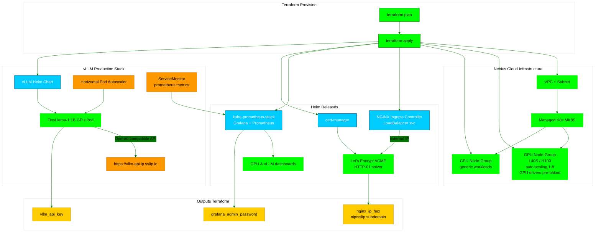

# 🧑🏼‍🚀 vLLM Production Stack on Nebius MK8s with terraform
<!-- canvas.md -->


✍🏼 This guide shows how to deploy the **vLLM Production Stack** on **Nebius MK8s** with GPU support, leveraging Terraform.

| Project Item           | Description                                                                                                                     |
| ---------------------- | ------------------------------------------------------------------------------------------------------------------------------- |
| **Author**             | [@cloudthrill](https://cloudthrill.ca)                                                                                          |
| **Stack**              | Terraform ◦ helm ◦ Nebius AI Cloud ◦ Managed K8s (MK8S) ◦ Observability ◦ LetsEncrypt◦ vLLM                                     |
| **Module**             | Opinionated **GPU-first** blueprint for production vLLM inference on Nebius                                                     |
| **CNI**                | **Nebius VPC-Cilium** (default **overlay** mode)                                                                                |
| **Inference hardware** | **GPU-only** – **L40S (Intel/AMD)** or **H100/H200/B200** with **pre-baked NVIDIA drivers**; auto-scaling  nodes                |

<!-- markdownlint-disable MD051 MD036 MD056 -->
## 📋 Table of Contents

1. [Project structure](#-project-structure)
2. [Prerequisites](#-prerequisites)
3. [What Terraform Deploys](#%EF%B8%8F-what-terraform-deploys)
4. [Hardware Options](#-hardware-options)
5. [Configuration knobs](#%EF%B8%8Fconfiguration-knobs)
6. [Quick start](#-quick-start)
7. [Quick Test](#-quick-test)
8. [Observability](#-observability)
9. [Troubleshooting](#-troubleshooting)
10. [Additional Resources](#-additional-resources)

---

## 📂 Project Structure

```bash
./
├── cluster-tools.tf
├── data_sources.tf
├── main.tf
├── network.tf
├── output.tf
├── provider.tf
├── variables.tf
├── vllm-production-stack.tf
├── config
│   ├── helm
│   │   └── kube-prome-stack.yaml
│   ├── kubeconfig.tpl
│   ├── llm-stack
│   │   └── helm
│   │       ├── cpu
│   │       │   └── cpu-tinyllama-light-ingress-nebius.tpl
│   │       └── gpu
│   │           ├── gpu-operator-values.yaml
│   │           └── gpu-tinyllama-light-ingress-nebius.tpl
│   ├── manifests
│   │   └── letsencrypt-issuer.yaml
│   ├── vllm-dashboard.json
└── README.md             # ← you are here

```

---

## ✅ Prerequisites

| Tool                    | Version tested | Notes                                                 |
| ----------------------- | -------------- | ----------------------------------------------------- |
| **Terraform**           | ≥ 1.5.7        | tested on 1.5.7                                       |
| **nebius CLI**          | 0.12.109       | profile / federation auth                             |
| **kubectl**             | ≥ 1.30         | ±1 of control-plane                                   |
| **helm**                | ≥ 3.14         | used by `helm_release`                                |
| **kubernetes** provider | 2.38.0         | core K8s resources                                    |
| **local** provider      | 2.5.3          | local-exec, files                                     |
| **nebius** provider     | 0.5.124        | Nebius AI Cloud resources                             |
| **template** provider   | 2.2.0          | legacy templates (deprecated, kept for compatibility) |

<details>
 <summary><b>Follow steps to Install nebius CLI tool (Ubuntu/Debian) below 👇🏼</b></summary>

 ```bash
# Install tools
sudo apt-get install jq
curl -sSL https://storage.eu-north1.nebius.cloud/cli/install.sh | bash
###### Auto completion
nebius completion bash > ~/.nebius/completion.bash.inc
echo 'if [ -f ~/.nebius/completion.bash.inc ]; then source ~/.nebius/completion.bash.inc; fi' >> ~/.bashrc
source ~/.bashrc
```

</details>

**Configure nebius CLI**

```bash
$ nebius profile create
profile name: my-profile
Set api endpoint: api.nebius.cloud
Set federation endpoint: auth.nebius.com

# Opens browser for authentication
✔ Profile "my-profile" configured and activated

```

---

## 🏗️ What Terraform Deploys

<div align="center">

| Layer              | Component                                          | Deployment Time  |
| ------------------ | -------------------------------------------------- | ---------------- |
| **Infrastructure** | VPC + Subnet + Managed K8s (MK8S)                  | ~4 min 03 s      |
| **Add-ons**        | cert-manager, NGINX Ingress, kube-prometheus-stack | ~12 min 57 s     |
| **GPU Nodes**      | Auto-scaling L40S/H100/H200/B200 (1-8 nodes)       | ~1 min 56 s      |
| **vLLM production Stack**     | Model server + router + autoscaling layers           | ~12 min 49 s     |
| **Total**          | **End-to-end**                                     | **~20 min 41 s** |

</div>

### 1.📶 Networking

- **Single /16 private IP pool** (`10.20.0.0/16`) shared for nodes + pods
- **Additional /16 service-CIDR pool** (`10.96.0.0/16`) carved from the same parent pool
- **One private subnet** per AZ (derived from the pools) – no public subnets, no NAT Gateway
- **Native VPC-Cilium CNI** (overlay) – VXLAN/Geneve encapsulation, eBPF datapath, Hubble observability
- **NGINX Ingress Controller** exposed via **Nebius Load Balancer**

### 2. ☸️ MK8S Cluster

- Control plane v1.30 with two managed node-group Types

### 3. 📦 Add-ons

Core Nebius MK8s add-ons can be installed using their application catalog but the gpu operator isn't necessary when gpu setting is define in the node group reource

| Category          | Add-on                                                  |
| ----------------- | ------------------------------------------------------- |
| **CNI**           | **Nebius VPC-Cilium** (overlay, eBPF, Hubble)           |
| **Storage**       | **Compute-CSI** (block)                                 |
| **Ingress/LB**    | **NGINX Ingress Controller** (Nebius LB)                |
| **MK8S add-ons**  | CoreDNS, Metrics Server                                 |
| **Observability** | kube-prometheus-stack                                   |
| **Security**      | cert-manager (Let’s Encrypt HTTP-01)                    |
| **GPU**           | **Pre-baked NVIDIA drivers** (no separate GPU operator) |

### 4. 🧠 vLLM Production Stack (CPU/GPU)

- **Model serving**: (Default) Single TinyLlama-1.1B model replica
- **Load balancing**: Round-robin router service
- **Hugging Face token**: stored as Kubernetes Secret
- **LLM Storage**: Init container Persistent model caching under `/data/models/`
- **Default Helm charts**:  [gpu-tinyllama-light-ingress](./config/llm-stack/helm/gpu/gpu-tinyllama-light-ingress-nebius.tpl)

---

## 💡 Hardware Options

You can choose to deploy VLLM production stack on different GPU platforms and presets

## 🖥️ AWS GPU Instance Types Available

(T4 · L4 · V100 · A10G · A100) . Read the full list of AWS GPU instance offering [GPU instances reference](https://docs.nebius.com/compute/virtual-machines/types).
<details><summary><b> Available GPU instances</b></summary>
<br>

| Platform         | GPU                   | vCPUs  | RAM (GiB) | Region      | Use-case                 |
| ---------------- | --------------------- | ------ | --------- | ----------- | ------------------------ |
| **gpu-b200-sxm** | 8 × B200 NVL72        | 160    | 1792      | us-central1 | Frontier training        |
| **gpu-h200-sxm** | 8 × H200 NVLink       | 128    | 1600      | eu-n/w/us   | Large-scale training     |
| **gpu-h100-sxm** | 1-8 × H100 NVLink     | 16-128 | 200-1600  | eu-north1   | High-perf training       |
| **gpu-l40s-a**   | 1 × L40S PCIe (Intel) | 8-40   | 32-160    | eu-north1   | Cost-effective inference |
| **gpu-l40s-d**   | 1 × L40S PCIe (AMD)   | 16-192 | 96-1152   | eu-north1   | Cost-effective inference |

</details>

## GPU Specifications

| GPU Type (Nebius)           | Best For                                                | Relative Cost |
| --------------------------- | ------------------------------------------------------- | ------------- |
| **NVIDIA L40S (Intel/AMD)** | Cost-effective inference, edge AI, small-scale training | \$            |
| **NVIDIA H100 NVLink**      | High-performance training & large-scale inference       | \$\$          |
| **NVIDIA H200 NVLink**      | Large-model training, higher-memory workloads           | \$\$\$        |
| **NVIDIA B200 NVL72**       | Frontier-scale training, cutting-edge AI research       | \$\$\$\$      |

## 🛠️Configuration knobs

This stack provides extensive customization options to tailor your deployment:

| Variable                  | Default                           | Description |
|--------------------------|-----------------------------------|-------------|
| `neb_project_id`         | — (required)                      | Nebius project ID for deployment |
| `cluster_name`           | `vllm-neb-gpu`                    | Kubernetes cluster name |
| `k8s_version`            | `1.30`                            | Kubernetes version |
| `public_endpoint`        | `true`                            | Enable external API access |
| `gpu_platform`           | `gpu-l40s-d`                      | GPU instance type (L40s) |
| `gpu_node_min`           | `0`                               | Minimum GPU nodes |
| `gpu_node_max`           | `3`                               | Maximum GPU nodes |
| `enable_vllm`            | `true`                            | Deploy the vLLM stack |
| `hf_token`               | **«secret»**                      | Hugging Face token for model pulls |
| `grafana_admin_password` | **«secret»**                      | Admin password for observability stack |
| `letsencrypt_email`      | —                                 | Email for TLS certificates |
| `gpu_vllm_helm_config`   | `config/...tpl`                   | Helm values file used for GPU deployment |

### 📋 Complete Configuration Options

**This is just a subset of available variables.** For the full list of 20+ configurable options including:

- **Node group** sizing (CPU/GPU pools)
- **Observability stack** (Prometheus/Grafana)
- **Security settings** (cert-manager, external-secrets)
- **Network configuration** (VPC CIDR, subnets)

**📓** See the complete configuration template:

- **Environment variables**: [`env-vars.template`](./env-vars.template)
- **Terraform variables tfvars**: [`terraform.tfvars.template`](./terraform.tfvars.template)

<details><summary><b> Full list of variables 👇🏼</b></summary>

## Requirements

| Name | Version |
|------|---------|
| <a name="requirement_helm"></a> [helm](#requirement\_helm) | >= 2.15 |
| <a name="requirement_kubectl"></a> [kubectl](#requirement\_kubectl) | >= 1.19.0 |
| <a name="requirement_kubernetes"></a> [kubernetes](#requirement\_kubernetes) | ~> 2.10 |
| <a name="requirement_local"></a> [local](#requirement\_local) | >= 2.5 |
| <a name="requirement_nebius"></a> [nebius](#requirement\_nebius) | >= 0.5.55 |

## Providers

| Name | Version |
|------|---------|
| <a name="provider_helm"></a> [helm](#provider\_helm) | 3.0.2 |
| <a name="provider_kubectl"></a> [kubectl](#provider\_kubectl) | 1.19.0 |
| <a name="provider_kubernetes"></a> [kubernetes](#provider\_kubernetes) | 2.38.0 |
| <a name="provider_local"></a> [local](#provider\_local) | 2.5.3 |
| <a name="provider_nebius"></a> [nebius](#provider\_nebius) | 0.5.124 |
| <a name="provider_template"></a> [template](#provider\_template) | 2.2.0 |

## Modules

No modules.

## Resources

| Name | Type |
|------|------|
| [helm_release.kube_prometheus_stack](https://registry.terraform.io/providers/hashicorp/helm/latest/docs/resources/release) | resource |
| [helm_release.nginx_ingress](https://registry.terraform.io/providers/hashicorp/helm/latest/docs/resources/release) | resource |
| [helm_release.vllm_stack](https://registry.terraform.io/providers/hashicorp/helm/latest/docs/resources/release) | resource |
| [kubectl_manifest.letsencrypt_issuer](https://registry.terraform.io/providers/gavinbunney/kubectl/latest/docs/resources/manifest) | resource |
| [kubectl_manifest.vllm_service_monitor](https://registry.terraform.io/providers/gavinbunney/kubectl/latest/docs/resources/manifest) | resource |
| [kubernetes_config_map.vllm_dashboard](https://registry.terraform.io/providers/hashicorp/kubernetes/latest/docs/resources/config_map) | resource |
| [kubernetes_namespace.vllm](https://registry.terraform.io/providers/hashicorp/kubernetes/latest/docs/resources/namespace) | resource |
| [kubernetes_secret.hf_token](https://registry.terraform.io/providers/hashicorp/kubernetes/latest/docs/resources/secret) | resource |
| [local_file.kubeconfig](https://registry.terraform.io/providers/hashicorp/local/latest/docs/resources/file) | resource |
| nebius_applications_v1alpha1_k8s_release.cert_manager | resource |
| nebius_mk8s_v1_cluster.k8s | resource |
| nebius_mk8s_v1_node_group.cpu | resource |
| nebius_mk8s_v1_node_group.gpu | resource |
| nebius_vpc_v1_network.k8s | resource |
| nebius_vpc_v1_pool.main | resource |
| nebius_vpc_v1_subnet.k8s | resource |
| [kubernetes_resources.vllm_ingresses](https://registry.terraform.io/providers/hashicorp/kubernetes/latest/docs/data-sources/resources) | data source |
| [kubernetes_service.nginx_ingress](https://registry.terraform.io/providers/hashicorp/kubernetes/latest/docs/data-sources/service) | data source |
| nebius_iam_v1_project.current | data source |
| [template_file.vllm_values](https://registry.terraform.io/providers/hashicorp/template/latest/docs/data-sources/file) | data source |

## Inputs

| Name | Description | Type | Default | Required |
|------|-------------|------|---------|:--------:|
| <a name="input_cluster_name"></a> [cluster\_name](#input\_cluster\_name) | Managed Kubernetes cluster name | `string` | `"vllm-neb-gpu"` | yes |
| <a name="input_cpu_disk_size_gb"></a> [cpu\_disk\_size\_gb](#input\_cpu\_disk\_size\_gb) | OS disk size for CPU nodes | `number` | `128` | no |
| <a name="input_cpu_disk_type"></a> [cpu\_disk\_type](#input\_cpu\_disk\_type) | OS Disk Type variables | `string` | `"NETWORK_SSD"` | no |
| <a name="input_enable_cert_manager"></a> [enable\_cert\_manager](#input\_enable\_cert\_manager) | n/a | `bool` | `true` | no |
| <a name="input_enable_vllm"></a> [enable\_vllm](#input\_enable\_vllm) | Deploy VLLM inference stack via Helm | `bool` | `false` | no |
| <a name="input_gpu_disk_size_gb"></a> [gpu\_disk\_size\_gb](#input\_gpu\_disk\_size\_gb) | OS disk size for GPU nodes | `number` | `128` | no |
| <a name="input_gpu_disk_type"></a> [gpu\_disk\_type](#input\_gpu\_disk\_type) | n/a | `string` | `"NETWORK_SSD"` | no |
| <a name="input_gpu_node_max"></a> [gpu\_node\_max](#input\_gpu\_node\_max) | Maximum GPU nodes | `number` | `3` | yes |
| <a name="input_gpu_node_min"></a> [gpu\_node\_min](#input\_gpu\_node\_min) | Minimum GPU nodes (zero-scale friendly) | `number` | `0` | yes |
| <a name="input_gpu_platform"></a> [gpu\_platform](#input\_gpu\_platform) | GPU hardware platform | `string` | `"gpu-l40s-d"` | yes |
| <a name="input_gpu_preset"></a> [gpu\_preset](#input\_gpu\_preset) | Preset (vCPU/RAM/GPU) for GPU nodes | `string` | `"1gpu-8vcpu-32gb"` | no |
| <a name="input_gpu_vllm_helm_config"></a> [gpu\_vllm\_helm\_config](#input\_gpu\_vllm\_helm\_config) | Path to GPU VLLM Helm values template | `string` | `"config/llm-stack/helm/gpu/gpu-tinyllama-light-ingress-nebius.tpl"` | no |
| <a name="input_grafana_admin_password"></a> [grafana\_admin\_password](#input\_grafana\_admin\_password) | n/a | `string` | `"admin1234"` | yes |
| <a name="input_hf_token"></a> [hf\_token](#input\_hf\_token) | Hugging Face token for model download | `string` | `""` | yes |
| <a name="input_k8s_version"></a> [k8s\_version](#input\_k8s\_version) | Kubernetes control-plane version | `string` | `"1.30"` | yes |
| <a name="input_letsencrypt_email"></a> [letsencrypt\_email](#input\_letsencrypt\_email) | n/a | `string` | `"info@gmail.com"` | yes |
| <a name="input_neb_profile"></a> [neb\_profile](#input\_neb\_profile) | nebius profile to use | `string` | `"mynebius_cli_profile"` | no |
| <a name="input_neb_project_id"></a> [neb\_project\_id](#input\_neb\_project\_id) | Nebius project ID (leave empty to use CLI profile default) | `string` | `""` | no |
| <a name="input_ops_email"></a> [ops\_email](#input\_ops\_email) | Email address for budget alert notifications | `string` | `"info@example.com"` | no |
| <a name="input_prometheus_pv_size"></a> [prometheus\_pv\_size](#input\_prometheus\_pv\_size) | Prometheus persistent volume size | `string` | `"25Gi"` | no |
| <a name="input_prometheus_retention"></a> [prometheus\_retention](#input\_prometheus\_retention) | Prometheus data retention period | `string` | `"15d"` | no |
| <a name="input_prometheus_scrape_interval"></a> [prometheus\_scrape\_interval](#input\_prometheus\_scrape\_interval) | Prometheus scrape interval | `string` | `"1m"` | no |
| <a name="input_public_endpoint"></a> [public\_endpoint](#input\_public\_endpoint) | Expose Kubernetes API on a public IP | `bool` | `true` | no |
| <a name="input_region"></a> [region](#input\_region) | Nebius region for the cluster | `string` | `"eu-north1"` | no |
| <a name="input_service_cidr"></a> [service\_cidr](#input\_service\_cidr) | CIDR block for service IPs | `string` | `"10.96.0.0/16"` | yes |
| <a name="input_shared_fs_size_tb"></a> [shared\_fs\_size\_tb](#input\_shared\_fs\_size\_tb) | Size of the shared filesystem in TiB | `number` | `1` | no |
| <a name="input_shared_fs_type"></a> [shared\_fs\_type](#input\_shared\_fs\_type) | Underlying disk type for the filesystem | `string` | `"network-ssd"` | no |
| <a name="input_subnetwork2_cidr"></a> [subnetwork2\_cidr](#input\_subnetwork2\_cidr) | Primary CIDR for the subnetwork | `string` | `"10.20.2.0/24"` | no |
| <a name="input_subnetwork3_cidr"></a> [subnetwork3\_cidr](#input\_subnetwork3\_cidr) | Primary CIDR for the subnetwork | `string` | `"10.20.3.0/24"` | no |
| <a name="input_subnetwork_cidr"></a> [subnetwork\_cidr](#input\_subnetwork\_cidr) | Primary CIDR for the subnetwork | `string` | `"10.20.1.0/24"` | no |
| <a name="input_tags"></a> [tags](#input\_tags) | Labels applied to every Nebius resource | `map(string)` | <pre>{<br/>  "application": "ai-inference",<br/>  "costcenter": "ai-1234",<br/>  "environment": "production",<br/>  "project": "vllm-production-stack",<br/>  "team": "llmops"<br/>}</pre> | no |
| <a name="input_vpc_cidr"></a> [vpc\_cidr](#input\_vpc\_cidr) | CIDR block for the VPC. | `string` | `"10.20.0.0/16"` | yes |
| <a name="input_vpc_name"></a> [vpc\_name](#input\_vpc\_name) | Name for the VPC network | `string` | `"vllm-vpc"` | yes |
| <a name="input_zone"></a> [zone](#input\_zone) | Availability zone (must belong to var.region) | `string` | `"eu-north1-a"` | no |

## Outputs

| Name | Description |
|------|-------------|
| <a name="output_Stack_Info"></a> [Stack\_Info](#output\_Stack\_Info) | n/a |
| <a name="output_cluster_endpoint"></a> [cluster\_endpoint](#output\_cluster\_endpoint) | n/a |
| <a name="output_cluster_id"></a> [cluster\_id](#output\_cluster\_id) | n/a |
| <a name="output_cpu_node"></a> [cpu\_node](#output\_cpu\_node) | CPU Node Group Name |
| <a name="output_cpu_node_platform"></a> [cpu\_node\_platform](#output\_cpu\_node\_platform) | CPU Platform |
| <a name="output_cpu_node_preset"></a> [cpu\_node\_preset](#output\_cpu\_node\_preset) | CPU Preset |
| <a name="output_gpu_node"></a> [gpu\_node](#output\_gpu\_node) | GPU Node Group Name |
| <a name="output_gpu_node_gpu_settings"></a> [gpu\_node\_gpu\_settings](#output\_gpu\_node\_gpu\_settings) | info |
| <a name="output_gpu_node_platform"></a> [gpu\_node\_platform](#output\_gpu\_node\_platform) | GPU Platform |
| <a name="output_gpu_node_preset"></a> [gpu\_node\_preset](#output\_gpu\_node\_preset) | GPU Preset |
| <a name="output_gpu_node_scaling"></a> [gpu\_node\_scaling](#output\_gpu\_node\_scaling) | n/a |
| <a name="output_gpu_nodegroup_id"></a> [gpu\_nodegroup\_id](#output\_gpu\_nodegroup\_id) | GPU Node Group ID |
| <a name="output_kubeconfig_cmd"></a> [kubeconfig\_cmd](#output\_kubeconfig\_cmd) | n/a |
| <a name="output_project_id"></a> [project\_id](#output\_project\_id) | n/a |
| <a name="output_subnet_cidr"></a> [subnet\_cidr](#output\_subnet\_cidr) | Subnet CIDR |
| <a name="output_subnet_id"></a> [subnet\_id](#output\_subnet\_id) | Created Subnet ID |
| <a name="output_success_message"></a> [success\_message](#output\_success\_message) | Success message |
| <a name="output_vllm_api_url"></a> [vllm\_api\_url](#output\_vllm\_api\_url) | The full HTTPS URL for the vLLM API |
| <a name="output_vpc_id"></a> [vpc\_id](#output\_vpc\_id) | Created VPC ID |
| <a name="output_vpc_name"></a> [vpc\_name](#output\_vpc\_name) | Created VPC name |

</details>

---

## 🚀 Quick start

### ⚙️ Provisioning logic

The deployment automatically provisions only the required infrastructure based on your hardware selection.

| Phase                 | Component                | Action                                                                    | Condition            |
| --------------------- | ------------------------ | ------------------------------------------------------------------------- | -------------------- |
| **1. Infra** | **IP pool + subnet** | Single private pool(`10.20.0.0/16`) + service-CIDR (`10.96.0.0/16`) | Always               |
|                       | **MK8S cluster**         | Deploy managed control plane + CPU node group                             | Always               |
|                       | **GPU node group**       | Auto-scaling L40S/H100/H200/B200 (1-8 nodes)                              | Always               |
| **2. Add-ons**        | **Ingress + TLS**        | NGINX controller + cert-manager (Let’s Encrypt)                       | Always               |
| **3. Observability**  | **Prometheus + Grafana** | GPU & vLLM dashboards                                                     | Always               |
| **4. vLLM Stack**     | **HF token secret**      | Create `hf-token-secret` for Hugging Face                                 | `enable_vllm = true` |
|                       | **vLLM Helm release**    | TinyLlama-1.1B model, GPU scheduling, init-container download             | `enable_vllm = true` |
|                       | **ServiceMonitor +Dashboard**       | Scrape `/metrics` endpoint                                                | `enable_vllm = true` |
| **5. Exposure**       | **HTTPS endpoint**       | `https://vllm-api.<ip>.sslip.io` (nip.io optional)                        | `enable_vllm = true` |

---

## 🔵 Deployment Steps

### 1. Clone the repository

```bash
git clone https://github.com/vllm-project/production-stack
cd production-stack/tutorials/terraform/nebius/
```

### 2. Configure the Environment

```bash
cp env-vars.template env-vars
vim env-vars  # Set HF token and customize deployment options
source env-vars
```

**Usage examples**

- **Option 1: Through Environment Variables**

   ```bash
   # Copy and customize
   $ cp env-vars.template env-vars
   $ vi env-vars
   ################################################################################
   # Nebius Project Credentials and Region
   ################################################################################
   export TF_VAR_neb_project_id=""  # (required) - Fill your Nebius Project ID
   export TF_VAR_neb_profile="my_nebius_profile" # (Required) replace with your Nebius
   ################################################################################
   # Nebius Cluster Configuration
   ################################################################################
   # ☸️ Nebius cluster basics
   export TF_VAR_cluster_name="vllm-eks-prod" # default: "vllm-eks-prod"
   export TF_VAR_cluster_version="1.30"       # default: "1.30" - Kubernetes cluster version
   ################################################################################
   # Cluster / Networking
   ################################################################################
   export TF_VAR_vpc_name="vllm-vpc"
   export TF_VAR_vpc_cidr="10.20.0.0/16"
   export TF_VAR_subnetwork_cidr="10.20.1.0/24"
   ################################################################################
   #  🧠 vLLM  Inference Configuration
   ################################################################################
   export TF_VAR_enable_vllm="true"
   export TF_VAR_hf_token=""   # Hugging Face token (sensitive)
   export TF_VAR_gpu_vllm_helm_config="config/llm-stack/helm/gpu/gpu-tinyllama-light-ingress-nebius.tpl"
   ################################################################################
   # ⚙️ GPU / Nodegroup settings
   ################################################################################
   export TF_VAR_gpu_node_min="0"
   export TF_VAR_gpu_node_max="3"
   export TF_VAR_gpu_platform="gpu-l40s-d"
   .snip
   $ source env-vars
   ```

- **Option 2: Through Terraform Variables**

  ```bash
   # Copy and customize
   $ cp terraform.tfvars.example terraform.tfvars
   $ vim terraform.tfvars
  ```

### 3. Deploy Infrastructure

```bash
terraform init
terraform plan
terraform apply
```

---

## 🧪 Quick Test

**1. Router Endpoint and API URL**

1.1 **Router Endpoint through port forwarding**
   run the following command:

```bash
kubectl -n vllm port-forward svc/vllm-gpu-router-service 30080:80

```

1.2 **Extracting the Router URL via NGINX Ingress***
If the NGINX Ingress Controller is enabled and the SSL certificate is authenticated by Let's Encrypt, the router endpoint ingress URL is displayed in the `vllm_api_url` output, or by running the following command:

```bash
$ k get ingress -n vllm -o json| jq -r .items[0].status.loadBalancer.ingress[].hostname
vllm-api.59a97308.nip.io
```

**2. List models**

```bash
-- case 1 : Port forwarding
export vllm_api_url=http://localhost:30080/v1
-- case 2 : nginx Ingress based SSL URL
export vllm_api_url=https://vllm-api.59a97308.nip.io/v1

---- check models
curl -s ${vllm_api_url}/models | jq .
```

**3. Completion**
Applicable for both ingress and port forwarding URLs

```bash
curl ${vllm_api_url}/completions     -H "Content-Type: application/json"     -d '{
        "model": "/data/models/tinyllama",
        "prompt": "Toronto is a",
        "max_tokens": 20,
        "temperature": 0
    }'| jq .choices[].text


//*
"city that is known for its vibrant nightlife, and there are plenty of bars and clubs"
//*

```

**5. vLLM model service**

```bash
kubectl -n vllm get svc
```

## 🔬 Observability

Grafana (if enabled) you can use port forwarding to access the dashboard. URL → "<http://localhost:3000>"

 ```bash
 kubectl port-forward svc/kube-prometheus-stack-grafana 3000:80 -n kube-prometheus-stack
# or
$ kubectl get ingress -n kube-prometheus-stack kube-prometheus-stack-grafana -o json | jq -r '.spec.rules[0].host'
 ```

- Login: admin
- Run the below command to fetch the password

```bash
kubectl get secret -n kube-prometheus-stack kube-prometheus-stack-grafana -o jsonpath="{.data.admin-password}" | base64 --decode
```

>[!note]
> In this stack, the vLLM dashboard and service monitoring are automatically configured in Grafana. No manual setup needed.
>

---

## 🎯 Troubleshooting

**1. nip.io rate limit attained during certification request for vllm router Ingress URL**

```bash
 429 ... too many certificates (10000) already issued for "nip.io" in the last 168h0m0s, retry after <date>
```

**Quick fix**

Edit the vLLM Helm [gpu-tinyllama-light-ingress](./config/llm-stack/helm/gpu/gpu-tinyllama-light-ingress-nebius.tpl) values and swap the domain :

```yaml
# line 101 - 110
ingress:
  hosts:
    - vllm-api.${nginx_ip_hex}.nip.io   # ← change to sslip.io (or vice-versa)
  tls:
    - hosts:
        - vllm-api.${nginx_ip_hex}.nip.io # ← change to sslip.io (or vice-versa)
```

---

## 📚 Additional Resources

- vLLM Production Stack: [https://github.com/vllm-project/production-stack](https://github.com/vllm-project/production-stack)
- Nebius Cloud Docs: [https://nebius.com/](https://nebius.com/)
- Nebius terraform provider: [https://docs.nebius.com/terraform-provider/reference/provider]
- Nebius MK8s: [https://docs.nebius.com/kubernetes]
- Nebius Networking requirements: [https://docs.nebius.com/kubernetes/networking/requirements]
- vLLM Docs: [https://docs.vllm.ai/](https://docs.vllm.ai/)

<!-- markdownlint-disable MD051 MD036 MD056 -->
